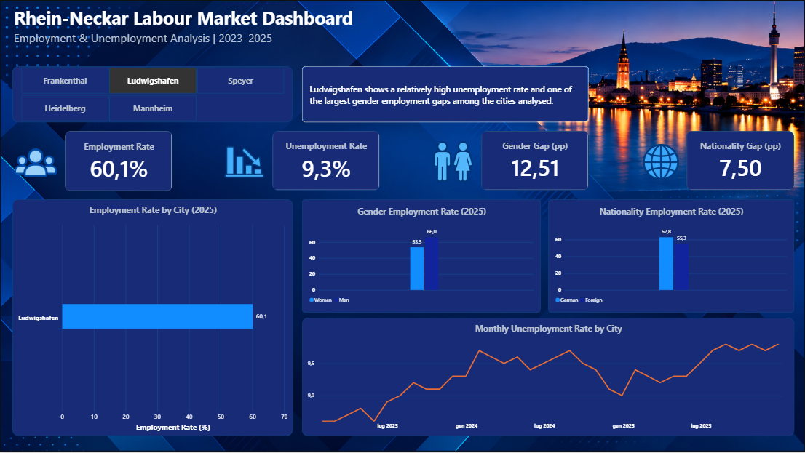

# Rhein-Neckar Labour Market Analysis
[English](README.md) | [Deutsch](README_DE.md)

## Project Overview

I live in the Rhein-Neckar region, and I wanted my first data analysis project to focus on something connected to the area where I live rather than using a generic dataset.

For this project, I analysed labour market data for five neighbouring cities:

- Ludwigshafen
- Mannheim
- Heidelberg
- Speyer
- Frankenthal

My main question was simple: **how different are the labour markets of cities that are geographically so close to each other?**

I focused on employment and unemployment between 2023 and 2025, looking at overall employment rates, differences by gender and nationality, unemployment trends and possible seasonal patterns.

The data comes from official statistics published by the German Federal Employment Agency (Bundesagentur für Arbeit).


## Tools & Workflow

I used different tools during the project, with each one covering a specific part of the analysis:

- **Python (Pandas)** – data cleaning, preparation and analysis
- **Matplotlib** – exploratory data visualisation
- **PostgreSQL / SQL** – querying and analysing the cleaned unemployment data
- **Power BI** – data modelling, DAX measures and the final interactive dashboard
- **Git & GitHub** – version control and project documentation
- **VS Code / Jupyter Notebook** – development and analysis environment

The workflow followed a simple path: I first explored and cleaned the raw data in Python, then used SQL to analyse the unemployment dataset from another perspective, and finally brought the cleaned data into Power BI to build the dashboard.


## Key Findings

A few things stood out to me during the analysis:

- **Employment rates differ considerably even between neighbouring cities.** In 2025, Speyer had the highest employment rate at 62.7%, while Heidelberg had the lowest at 51.8%.

- **The differences between cities seem quite persistent.** Between 2023 and 2025, Ludwigshafen was the only city in the group where the employment rate decreased, falling by about 0.8 percentage points. Speyer recorded the largest increase, at about 1.6 percentage points.

- **Gender gaps are still clearly visible.** Ludwigshafen showed the largest gender employment gap in 2025, at around 12.5 percentage points, while Heidelberg had the smallest at around 4.5 points.

- **Nationality revealed another interesting difference.** Mannheim had the largest gap between German and foreign employment rates, at around 10.5 percentage points. Heidelberg, on the other hand, had a much smaller gap of around 1.9 points.

- **Unemployment tells a different part of the story.** Ludwigshafen had the highest average unemployment rate over the period analysed, while Heidelberg had the lowest.

- **I also noticed a recurring seasonal pattern in unemployment.** Looking at the five cities together across 2023–2025, August had the highest average unemployment rate (7.33%) and May the lowest (6.89%). With only three years of data, I would treat this as an interesting pattern rather than a long-term conclusion.

What I found most interesting is that geographical proximity does not necessarily mean similar labour market outcomes. Cities only a short distance apart can show quite different employment rates, unemployment levels and gaps between population groups.


## Power BI Dashboard

To bring the different parts of the analysis together, I built an interactive Power BI dashboard.

The dashboard allows the user to select one of the five cities and immediately compare its employment rate, unemployment rate, gender gap and nationality gap. I also added a dynamic insight that changes according to the selected city, highlighting one of the most relevant findings from the analysis.




## Data Source

The analysis is based on official labour market statistics published by the **Bundesagentur für Arbeit (German Federal Employment Agency)**.

I worked with employment rate data and monthly unemployment data, focusing on the period from 2023 to 2025 and on the five cities included in the analysis.

The original datasets were cleaned and transformed in Python before being used for the analysis, SQL queries and Power BI dashboard.


## Project Structure

```text
rhein-neckar-labour-market/
│
├── data/
│   ├── sql/
│   │   └── unemployment_analysis.sql
│   ├── employment_clean.csv
│   └── unemployment_clean.csv
│
├── figures/
│   ├── employment_rate_gender_2025.png
│   ├── employment_rate_nationality_2025.png
│   ├── employment_rate_trends_2023_2025.png
│   ├── monthly_unemployment_rate_2023_2025.png
│   ├── population_vs_employment_rate_2025.png
│   └── rhein_neckar_labour_market_dashboard.png
│
├── notebooks/
│   ├── 01_data_inspection.ipynb
│   └── 02_labour_market_analysis.ipynb
│
├── powerbi/
│   └── rhein_neckar_labour_market_dashboard.pbix
│
└── README.md
```

The first notebook contains my initial data exploration, while the second contains the cleaned and organised analysis used for the final project.